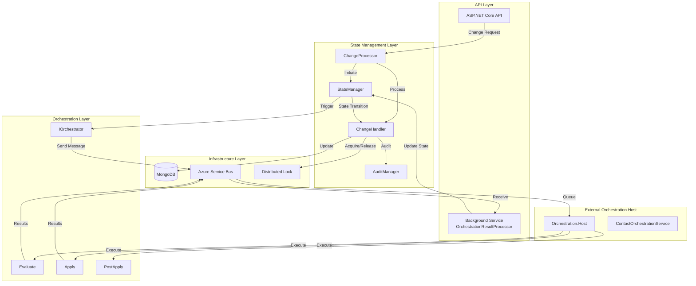
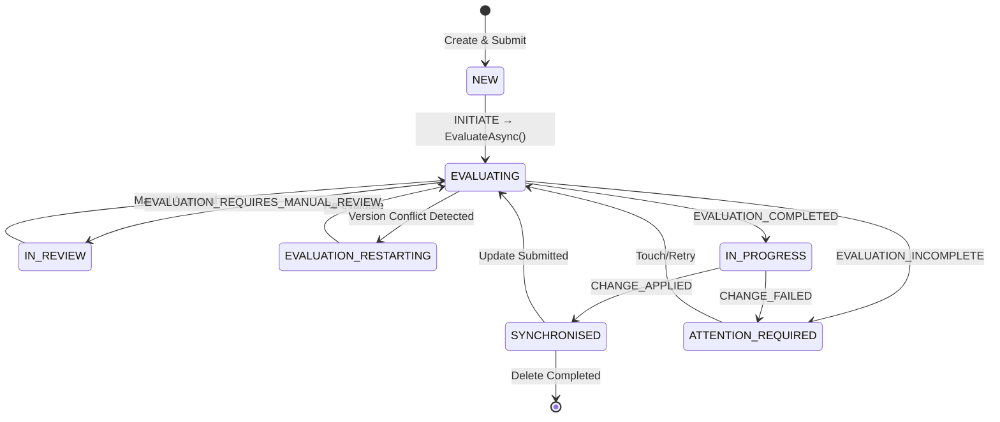
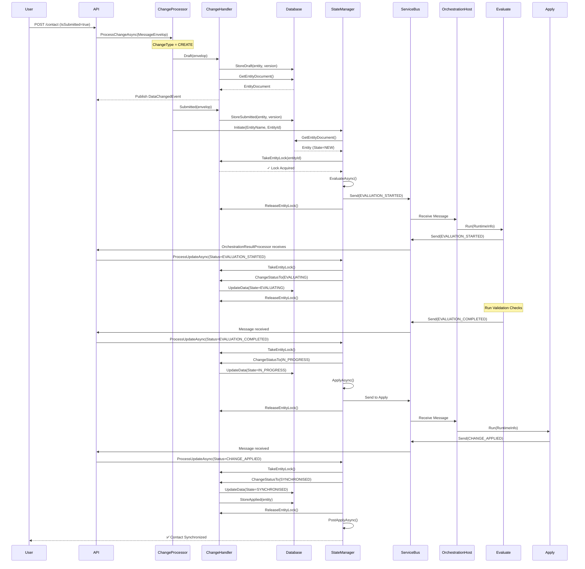
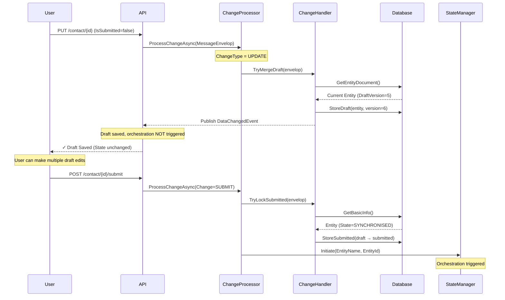
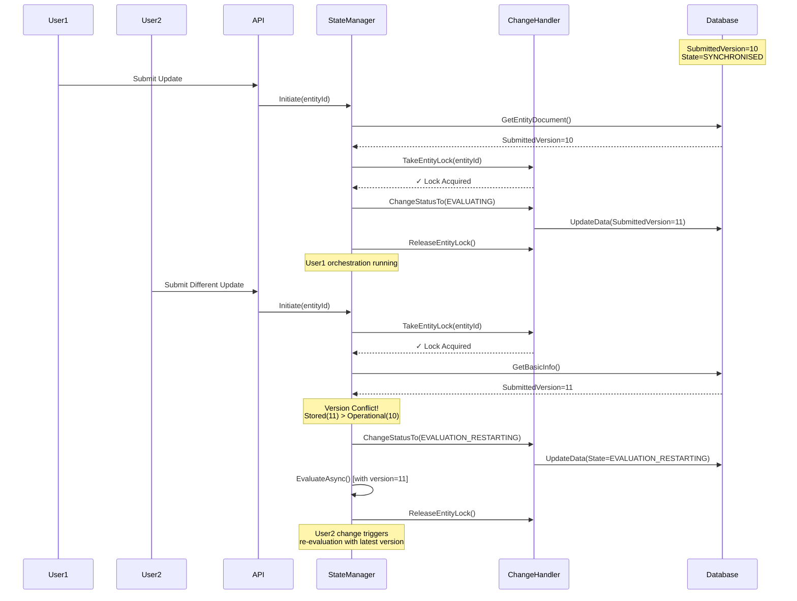
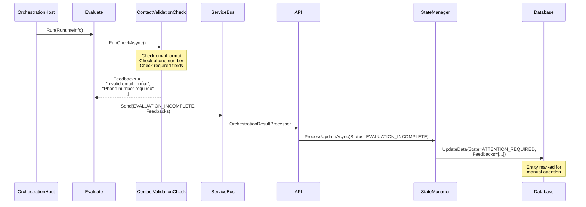

# Customer Management System - Technical Architecture Documentation

## Table of Contents
1. [Technical Overview](#technical-overview)
2. [Architecture Overview](#architecture-overview)
3. [System Components](#system-components)
4. [Design Patterns](#design-patterns)
5. [State Machine](#state-machine)
6. [Sequence Diagrams](#sequence-diagrams)
7. [Data Flow](#data-flow)
8. [Concurrency & Locking](#concurrency--locking)
9. [Integration Points](#integration-points)
10. [Technology Stack](#technology-stack)

---

## Technical Overview

The Customer Management System is a **.NET 9** distributed application that implements a sophisticated **event-driven state machine** for managing customer entity lifecycle. The system orchestrates complex, multi-step workflows involving validation, external system integration, and audit trails while ensuring data consistency and handling concurrent modifications.

### Key Technical Features

- **Finite State Machine (FSM)** for entity lifecycle management
- **Event-driven architecture** using Azure Service Bus
- **Distributed locking** for concurrency control
- **Optimistic concurrency** using version numbering
- **Draft/Submit pattern** for change management
- **Chain of Responsibility** for validation rules
- **Repository pattern** for data access abstraction
- **Background service processing** for orchestration results

---

## Architecture Overview

### High-Level Architecture Diagram



### Layered Architecture

```
┌─────────────────────────────────────────────────────────────┐
│                    Presentation Layer                       │
│  (ASP.NET Core API Controllers, Background Services)        │
└────────────────────┬────────────────────────────────────────┘
                     │
┌────────────────────▼────────────────────────────────────────┐
│                   Application Layer                          │
│   (ChangeProcessor, StateManager, ChangeHandler)            │
│   - Orchestrates business workflows                         │
│   - Manages state transitions                               │
│   - Coordinates between layers                              │
└────────────────────┬────────────────────────────────────────┘
                     │
┌────────────────────▼────────────────────────────────────────┐
│                    Domain Layer                              │
│   (ContactOrchestration: Evaluate, Apply, PostApply)        │
│   - Business logic and validation rules                     │
│   - Domain-specific orchestration                           │
│   - Entity definitions (Contact, Address, Descriptor)       │
└────────────────────┬────────────────────────────────────────┘
                     │
┌────────────────────▼────────────────────────────────────────┐
│                 Infrastructure Layer                         │
│   (MongoDB, Azure Service Bus, Distributed Lock)            │
│   - External system integration                             │
│   - Data persistence                                        │
│   - Message queue communication                             │
└─────────────────────────────────────────────────────────────┘
```

---

## System Components

### 1. **Api Project** - Entry Point & Orchestration Coordinator

**Responsibility**: HTTP API endpoints and background orchestration result processing

**Key Components**:
- `ContactController.cs`: REST API for CRUD operations
- `OrchestrationResultProcessor.cs`: Background service listening to orchestration results from Service Bus
- `Program.cs`: DI container configuration

**Dependencies**:
```csharp
builder.Services.AddSingleton<ICustomerDatabase, MongoCustomerDatabase>();
builder.Services.AddSingleton<IDistributedLock, DictionaryLock>();
builder.Services.AddSingleton<IEventPublisher, SimpleEventPublisher>();
builder.Services.AddSingleton<IAuditManager, AuditManager>();
builder.Services.AddSingleton<IChangeHandler, ChangeHandler>();
builder.Services.AddSingleton<IOrchestrator, BasicOrchestrator>();
builder.Services.AddSingleton<IStateManager, StateManager>();
builder.Services.AddSingleton<IChangeProcessor, ChangeProcessor>();
builder.Services.AddSingleton<IReceiver, AzureServiceBusMessageReceiver>();
```

### 2. **StateManagment Project** - Core State Machine Engine

**Responsibility**: Entity lifecycle management, state transitions, change processing

#### Key Components:

**StateManager**
- Central coordinator for state transitions
- Implements finite state machine logic
- Validates state transition rules based on current state and runtime status
- Manages entity locking during transitions

**ChangeProcessor**
- Entry point for all change requests (Create, Update, Delete, Touch, Submit)
- Implements draft/submit pattern
- Coordinates between ChangeHandler and StateManager

**ChangeHandler**
- Manages entity locking via `IDistributedLock`
- Handles draft and submitted version management
- Updates entity state in database
- Publishes state change events
- Triggers audit logging

**AuditManager**
- Records audit trail for all state changes
- Tracks Draft, Submitted, and Applied versions
- Maintains compliance records

#### Entity Model:
```csharp
public interface IEntity { }

public class Contact : IEntity
{
    public string FirstName { get; set; }
    public string LastName { get; set; }
    public string Telephone { get; set; }
    public string Email { get; set; }
    public Address PostalAddress { get; set; }
    public Descriptor[] Descriptors { get; set; }
}
```

#### State & Status Enums:
```csharp
public enum EntityState
{
    NEW,                        // Initial state
    EVALUATING,                 // Validation in progress
    IN_REVIEW,                  // Manual review required
    IN_PROGRESS,                // Applying changes
    SYNCHRONISED,               // Successfully synchronized
    ATTENTION_REQUIRED,         // Failed - needs attention
    EVALUATION_RESTARTING       // Version conflict - restarting
}

public enum RuntimeStatus
{
    INITIATE,                   // Start orchestration
    EVALUATION_STARTED,         // Evaluation phase started
    EVALUATION_COMPLETED,       // Validation passed
    EVALUATION_INCOMPLETE,      // Validation failed
    EVALUATION_REQUIRES_MANUAL_REVIEW,
    CHANGE_APPLIED,             // Changes applied successfully
    CHANGE_FAILED               // Apply failed
}
```

### 3. **ContactOrchestration Project** - Domain-Specific Business Logic

**Responsibility**: Contact-specific validation, integration, and post-processing

#### Key Components:

**Evaluate.cs**
- Runs validation rules using Chain of Responsibility pattern
- Sends `EVALUATION_STARTED`, `EVALUATION_COMPLETED`, or `EVALUATION_INCOMPLETE` status
- Returns `Feedback` objects for validation failures

```csharp
public async Task Run(RuntimeInfo runtimeInfo)
{
    await sender.SendAsync(..., RuntimeStatus.EVALUATION_STARTED);
    
    var rules = LoadRulesToExecute();
    await rules.RunCheckAsync(runtimeInfo);
    
    if (rules.Feedbacks.Count == 0)
        await sender.SendAsync(..., RuntimeStatus.EVALUATION_COMPLETED);
    else
        await sender.SendAsync(..., RuntimeStatus.EVALUATION_INCOMPLETE, feedbacks);
}
```

**Apply.cs**
- Integrates with external systems to apply changes
- Sends `CHANGE_APPLIED` or `CHANGE_FAILED` status

**PostApply.cs**
- Executes post-processing logic after successful application
- Examples: send notifications, update caches, trigger downstream processes

**Validation Checks** (Chain of Responsibility):
```csharp
// Base class
public abstract class Check
{
    protected Check? nextCheck;
    public List<Feedback> Feedbacks { get; set; } = new();
    
    public Check(Check? nextCheck) => this.nextCheck = nextCheck;
    
    public abstract Task<bool> RunCheckAsync(RuntimeInfo runtimeInfo);
}

// Concrete implementation
public class ContactValidationCheck : Check
{
    public override async Task<bool> RunCheckAsync(RuntimeInfo runtimeInfo)
    {
        // Validation logic
        if (validationFails)
            Feedbacks.Add(new Feedback { ... });
        
        return await nextCheck?.RunCheckAsync(runtimeInfo) ?? true;
    }
}
```

### 4. **Infrastructure Project** - External System Integrations

**MongoCustomerDatabase**
- CRUD operations for entity documents
- Version management (Draft, Submitted, Applied)
- State updates

**AzureServiceBusMessageSender/Receiver**
- Sends orchestration messages to Service Bus queues
- Receives orchestration results
- Correlation ID tracking for message tracing

### 5. **Orchestration.Host Project** - Independent Orchestration Runner

**Responsibility**: Hosts orchestration logic separately from API (can be scaled independently)

- Listens to orchestration trigger messages
- Executes Evaluate, Apply, PostApply phases
- Sends results back via Service Bus

---

## Design Patterns

### 1. **Finite State Machine (FSM)**
Manages complex entity lifecycle with well-defined states and transitions.

### 2. **Event-Driven Architecture**
Decouples API from orchestration using Azure Service Bus for asynchronous processing.

### 3. **Chain of Responsibility**
Validation rules are chained, allowing flexible rule composition:
```csharp
var evaluationComplete = new EvalutionComplete();
var contactValidation = new ContactValidationCheck(evaluationComplete);
return contactValidation; // First in chain
```

### 4. **Repository Pattern**
`ICustomerDatabase` abstracts data access, allowing multiple implementations (MongoDB, SQL, etc.).

### 5. **Command Pattern**
`MessageEnvelop` encapsulates change requests with all necessary metadata:
```csharp
public class MessageEnvelop
{
    public EntityName Name { get; set; }
    public string EntityId { get; set; }
    public ChangeType Change { get; set; }
    public bool IsSubmitted { get; set; }
    public IEntity Draft { get; set; }
    public int DraftVersion { get; set; }
    public string UpdateUser { get; set; }
}
```

### 6. **Strategy Pattern**
`IOrchestrator` allows different orchestration strategies per entity type.

### 7. **Observer Pattern**
`IEventPublisher` publishes state change events for consumers to react.

---

## State Machine

### State Transition Rules

The `StateManager.ProcessUpdateAsync()` method implements the state machine logic:

```csharp
switch (storedEntity.State)
{
    case EntityState.NEW when operationalEntity.Status == RuntimeStatus.INITIATE:
    case EntityState.SYNCHRONISED when operationalEntity.Status == RuntimeStatus.INITIATE:
        await orchestrator.EvaluateAsync(...);
        break;

    case EntityState.EVALUATING when operationalEntity.Status == RuntimeStatus.EVALUATION_COMPLETED:
        await changeHandler.ChangeStatusTo(..., EntityState.IN_PROGRESS);
        await orchestrator.ApplyAsync(...);
        break;

    case EntityState.EVALUATING when operationalEntity.Status == RuntimeStatus.EVALUATION_INCOMPLETE:
        await changeHandler.ChangeStatusTo(..., EntityState.ATTENTION_REQUIRED);
        break;

    case EntityState.IN_PROGRESS when operationalEntity.Status == RuntimeStatus.CHANGE_APPLIED:
        await changeHandler.ChangeStatusTo(..., EntityState.SYNCHRONISED);
        await orchestrator.PostApplyAsync(...);
        break;
        
    default:
        return TaskOutcome.TRANSITION_NOT_SUPPORTED;
}
```

### State Diagram



---

## Sequence Diagrams

### 1. Create and Submit Contact (Happy Path)



### 2. Update with Draft/Submit Pattern



### 3. Concurrent Update Handling



### 4. Validation Failure Flow



---

## Data Flow

### Entity Document Structure in MongoDB

```json
{
  "_id": "d9b15755-934b-4a57-a750-1359568e6a31",
  "entityName": "Contact",
  "state": "SYNCHRONISED",
  "draftVersion": 3,
  "submittedVersion": 2,
  "appliedVersion": 2,
  "draft": {
    "firstName": "John",
    "lastName": "Smith",
    "email": "john.smith@example.com",
    "telephone": "555-1234",
    "postalAddress": { ... }
  },
  "submitted": {
    "firstName": "John",
    "lastName": "Smith",
    "email": "john.smith@example.com"
  },
  "applied": {
    "firstName": "John",
    "lastName": "Smith",
    "email": "john.smith@example.com"
  },
  "feedbacks": [],
  "orchestrationData": [],
  "lastUpdatedBy": "user@example.com",
  "lastUpdatedDate": "2024-01-15T10:30:00Z"
}
```

### Version Management

- **Draft Version**: Incremented on every draft save (regardless of submission)
- **Submitted Version**: Incremented when changes are submitted for processing
- **Applied Version**: Updated when changes are successfully synchronized

**Version Flow**:
```
Draft v1 → Submit → Submitted v1 → Apply → Applied v1 (SYNCHRONISED)
Draft v2 → (not submitted)
Draft v3 → Submit → Submitted v2 → Apply → Applied v2 (SYNCHRONISED)
```

---

## Concurrency & Locking

### Distributed Lock Strategy

**Lock Acquisition**:
```csharp
public async Task<TaskOutcome> TakeEntityLock(string entityId)
{
    var lockResult = await distributedLock.Lock(entityId);
    return lockResult ? TaskOutcome.OK : TaskOutcome.ENTITY_LOCKED;
}
```

**Critical Sections Protected by Locks**:
1. **State Transitions**: Lock acquired before state change, released after
2. **Version Checks**: Lock held during version comparison and update
3. **Submit Operations**: Lock acquired to prevent concurrent submissions

**Lock Scope**:
- Lock is per-entity (identified by `entityId`)
- Lock duration: Only during state transition processing
- Lock is always released in `finally` block to prevent deadlocks

### Optimistic Concurrency Control

**Version Conflict Detection**:
```csharp
var submittedVersionCompare = storedEntity.SubmittedVersion == operationalEntity.SubmittedVersion;

if (!submittedVersionCompare && storedEntity.SubmittedVersion > operationalEntity.SubmittedVersion)
{
    await changeHandler.ChangeStatusTo(..., EntityState.EVALUATION_RESTARTING);
    return await orchestrator.EvaluateAsync(...); // Re-evaluate with latest version
}
```

**Conflict Resolution Strategy**:
- Last-write-wins for draft changes
- Re-evaluation for submitted changes when version conflicts occur

---

## Integration Points

### 1. **Azure Service Bus Integration**

**Message Flow**:
```
API → ServiceBus Queue (orchestration.triggers)
     ↓
Orchestration.Host (Consumer)
     ↓
Process (Evaluate/Apply/PostApply)
     ↓
ServiceBus Queue (orchestration.results)
     ↓
API Background Service (Consumer)
     ↓
StateManager (Update state)
```

**Message Structure** (`OrchestrationEnvelop`):
```csharp
public class OrchestrationEnvelop
{
    public EntityName Name { get; set; }
    public string EntityId { get; set; }
    public int SubmittedVersion { get; set; }
    public RuntimeStatus Status { get; set; }
    public Feedback[]? Feedbacks { get; set; }
    public OrchestrationData[]? OrchestrationData { get; set; }
}
```

### 2. **MongoDB Integration**

**Key Operations**:
- `GetEntityDocument(EntityName, string entityId)`: Retrieve full entity
- `GetBasicInfo(EntityName, string entityId)`: Retrieve metadata only (state, versions)
- `StoreDraft(MessageEnvelop, int version)`: Save draft changes
- `StoreSubmitted(EntityName, IEntity, string entityId, string user)`: Lock submitted version
- `StoreApplied(EntityName, IEntity, string entityId)`: Mark as synchronized
- `UpdateData(EntityName, string entityId, EntityState, Feedback[], OrchestrationData[])`: Update state

### 3. **Event Publishing**

**IEventPublisher Interface**:
```csharp
public interface IEventPublisher
{
    Task<TaskOutcome> DataChangedAsync(EntityDocument entityDocument);
}
```

**Event Types**:
- `ChangeDetected`: Draft saved
- `ChangeSubmitted`: Submitted for processing
- State transition events

---

## Technology Stack

| Component | Technology | Version |
|-----------|-----------|---------|
| Framework | .NET | 9.0 |
| API Framework | ASP.NET Core | 9.0 |
| Database | MongoDB | Latest |
| Message Queue | Azure Service Bus | Latest |
| Language | C# | 13.0 |
| Dependency Injection | Microsoft.Extensions.DependencyInjection | Built-in |
| Background Services | IHostedService | Built-in |

---

## Configuration

### Dependency Injection Setup (Program.cs)

```csharp
// Infrastructure
builder.Services.AddSingleton<ICustomerDatabase, MongoCustomerDatabase>();
builder.Services.AddSingleton<IDistributedLock, DictionaryLock>(); // In-memory for dev
builder.Services.AddSingleton<IReceiver, AzureServiceBusMessageReceiver>();

// State Management
builder.Services.AddSingleton<IEventPublisher, SimpleEventPublisher>();
builder.Services.AddSingleton<IAuditManager, AuditManager>();
builder.Services.AddSingleton<IChangeHandler, ChangeHandler>();
builder.Services.AddSingleton<IOrchestrator, BasicOrchestrator>();
builder.Services.AddSingleton<IStateManager, StateManager>();
builder.Services.AddSingleton<IChangeProcessor, ChangeProcessor>();

// Background Services
builder.Services.AddHostedService<OrchestrationResultProcessor>();
```

### Production Considerations

**Distributed Lock Implementation**:
- Development: `DictionaryLock` (in-memory)
- Production: Redis-based or Azure Blob Lease-based distributed lock

**Scaling Orchestration.Host**:
- Deploy as separate service/container
- Scale independently from API
- Use competing consumers pattern on Service Bus

**Error Handling**:
- Implement retry policies with exponential backoff
- Dead-letter queue for failed messages
- Circuit breaker for external system calls

---

## Key Technical Insights

### 1. **Why Event-Driven Architecture?**
- **Decouples** API from long-running orchestration processes
- **Enables** independent scaling of API and orchestration hosts
- **Provides** natural retry and error handling mechanisms
- **Supports** async processing without blocking HTTP requests

### 2. **Why Finite State Machine?**
- **Enforces** valid state transitions (prevents invalid states)
- **Simplifies** complex workflow logic
- **Makes** system behavior predictable and testable
- **Enables** recovery from failures at any point

### 3. **Why Draft/Submit Pattern?**
- **Allows** users to make multiple edits without triggering validation
- **Reduces** unnecessary orchestration overhead
- **Provides** "save and continue later" functionality
- **Separates** data entry from business process execution

### 4. **Version Conflict Handling**
- **Detects** concurrent modifications automatically
- **Triggers** re-evaluation instead of failing
- **Ensures** no changes are lost
- **Maintains** data consistency

---

## Development Guidelines

### Adding a New Entity Type

1. **Create Entity Class** in `StateManagment/Entity/`
2. **Add EntityName Enum** value
3. **Create Orchestration Project** (e.g., `ProductOrchestration`)
4. **Implement** `Evaluate`, `Apply`, `PostApply` classes
5. **Add Validation Rules** using Chain of Responsibility
6. **Register** orchestrator in DI container
7. **Create** MongoDB entity configuration

### Adding a New Validation Rule

```csharp
public class NewValidationCheck : Check
{
    public NewValidationCheck(Check? nextCheck) : base(nextCheck) { }
    
    public override async Task<bool> RunCheckAsync(RuntimeInfo runtimeInfo)
    {
        // Validation logic
        if (validationFails)
        {
            Feedbacks.Add(new Feedback 
            { 
                Type = FeedbackType.ERROR,
                Message = "Validation error message",
                Code = "VALIDATION_001"
            });
        }
        
        // Call next check in chain
        return await nextCheck?.RunCheckAsync(runtimeInfo) ?? true;
    }
}
```

### Testing Strategy

1. **Unit Tests**: Test individual components (StateManager, ChangeProcessor)
2. **Integration Tests**: Test end-to-end flows with real MongoDB and Service Bus
3. **State Transition Tests**: Verify all valid state transitions
4. **Concurrency Tests**: Test concurrent modifications and version conflicts
5. **Orchestration Tests**: Test validation, apply, and post-apply logic

---

## Performance Considerations

### Bottlenecks to Monitor

1. **MongoDB Queries**: Ensure indexes on `entityId` and `state`
2. **Service Bus Throughput**: Monitor queue depth and processing time
3. **Lock Contention**: Monitor lock acquisition failures
4. **Orchestration Duration**: Track time in each state

### Optimization Strategies

1. **Caching**: Cache frequently accessed entity metadata
2. **Batch Processing**: Process multiple state transitions in batch
3. **Async All The Way**: Ensure all I/O operations are async
4. **Connection Pooling**: Configure MongoDB and Service Bus connection pools

---

## Monitoring & Observability

### Key Metrics to Track

- State transition times (by state)
- Lock acquisition success/failure rate
- Version conflict frequency
- Orchestration completion rate
- Message queue depth
- Database query performance

### Logging Strategy

```csharp
// Example structured logging
_logger.LogInformation(
    "State transition: EntityId={EntityId}, From={FromState}, To={ToState}, Version={Version}",
    entityId, fromState, toState, version);
```

### Distributed Tracing

Use correlation IDs to trace requests across:
- API → Service Bus → Orchestration Host → Service Bus → API

---

## Security Considerations

1. **Authentication**: Implement Azure AD authentication for API
2. **Authorization**: Role-based access control for operations
3. **Audit Trail**: Complete audit log via `AuditManager`
4. **Data Encryption**: Encrypt sensitive fields in MongoDB
5. **Message Security**: Use Service Bus managed identity
6. **Lock Security**: Prevent lock hijacking with owner tokens

---

## Future Enhancements (from README)

- [ ] Complete pub/sub integration for data change events
- [ ] Operational data store as event stream storage
- [ ] Additional entity types (Legal Entity, Product, Trading Location)
- [ ] Complete validation implementation for Contact
- [ ] Enhanced runtime hosting capabilities
- [ ] Submit all endpoint
- [ ] Abort/reset orchestration endpoint
- [ ] Get all changes endpoint

---

## Conclusion

This architecture provides a robust, scalable foundation for managing complex entity lifecycles with:
- Strong consistency guarantees
- Resilient error handling
- Comprehensive audit trails
- Independent component scaling
- Clear separation of concerns

The combination of FSM, event-driven architecture, and distributed locking ensures reliable processing even under high concurrency and failure scenarios.
